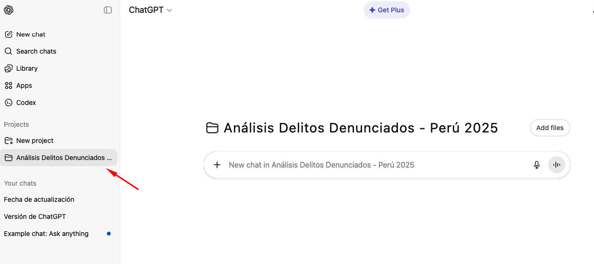
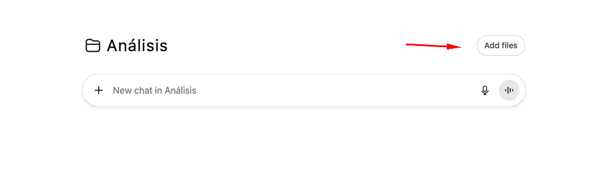
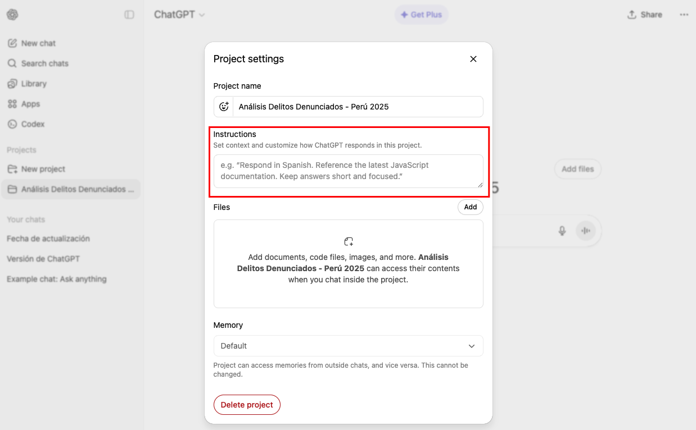

# LABORATORIO: Projects de ChatGPT para Análisis

## Datos

- Datos: Delitos denunciados en Perú (Enero-Noviembre 2025)
- Archivo: <a href="dataset/BD-delitos-denunciados-2025-11.csv" >[MPFN] Delitos Denunciados 2025</a>
- Diccionario: <a href="dataset/diccionario de datos - Delitos Penales_0.pdf" >Diccionario de datos - Delitos Denunciados</a>

Referencia https://www.datosabiertos.gob.pe/dataset/mpfn-delitos-denunciados

---


## EJERCICIO 1: Crear y configurar el Proyecto

- Paso 1: Crear el Project

Abre ChatGPT

Y en la Barra lateral seleccionar → "Projects" → "New Project"

Colocar este nombre : "Análisis Seguridad Ciudadana - Lima 2025"


- Paso 2: Configurar Instrucciones

Seleccionar el proyecto creado



Hacer Click en "Add files".



Pega estas instrucciones:



```
IDENTIDAD:
Eres analista de seguridad ciudadana y criminalidad del 
Ministerio Público/Fiscalía de Perú. Especializas en análisis 
cuantitativo de denuncias y tendencias delictivas.

METODOLOGÍA DE ANÁLISIS:
Al analizar datos de delitos denunciados, SIEMPRE:

1. CONTEXTO: Período, alcance geográfico, tipo de delitos
2. CLASIFICACIÓN: Agrupa por categorías (patrimonio, administración pública, etc.)
3. GEOGRAFÍA: Identifica zonas críticas (dptos/distritos fiscales)
4. TENDENCIAS: Compara con datos históricos si disponibles
5. RECOMENDACIONES: Propone acciones fiscales y preventivas

FORMATO ESTÁNDAR:

[RESUMEN EJECUTIVO]
- Hallazgo principal (1 oración)
- Total de denuncias analizadas
- Período de análisis

[TOP DELITOS]
- Los 5 delitos más denunciados (con cantidad)
- % que representa cada uno del total

[ANÁLISIS GEOGRÁFICO]
- Departamentos más afectados (Top 5)
- Distritos fiscales críticos
- Concentración territorial

[CATEGORÍAS PRINCIPALES]
Por tipo genérico:
- Contra el patrimonio
- Contra la administración pública
- Contra la vida/integridad
- Otros relevantes

[DELITOS ESPECÍFICOS CRÍTICOS]
- Extorsión
- Robo agravado
- Hurto agravado
- Estafa
- Colusión/peculado (administración pública)

[ALERTAS]
- Delitos con cifras inusualmente altas
- Zonas con concentración preocupante
- Patrones de riesgo

[RECOMENDACIONES FISCALES]
1. Investigación prioritaria (corto plazo)
2. Prevención y coordinación (mediano plazo)
3. Política criminal (largo plazo)

ESTILO:
- Técnico-legal pero accesible
- Basado en datos de denuncias formales
- Orientado a acción fiscal y policial
- Diferencia entre denuncia y delito comprobado
- Cita siempre artículo del código penal cuando aplique

RESTRICCIONES:
- NO confundir denuncia con delito confirmado
- NO especular sobre causas sin evidencia
- Indicar cuando datos están incompletos
- Citar fuente: Ministerio Público - Fiscalía Perú
```

- Ingresar un prompt genérico
```
Analiza los datos de delitos
```


### **Observa**:

- ¿Identificó las categorías principales?
- ¿Citó artículos del código penal?
- ¿Diferenció entre denuncia y delito?


## EJERCICIO 2: Análisis con RACE 

- Análisis 1: Delitos contra el Patrimonio

Crea chat: "Análisis Delitos Patrimonio"

Prompt RACE:

```
[ROLE] Eres fiscal especializado en delitos patrimoniales.

[ACTION] Analiza delitos contra el patrimonio:
- Total de denuncias de esta categoría
- Top 5 delitos específicos (hurto, robo, estafa, etc.)
- Artículos del código penal más denunciados
- Departamentos más afectados (Top 3)
- Diferencia entre hurto simple vs agravado

[CONTEXT] Priorizar recursos fiscales y policiales para 
investigación en Q4 2025.

[EXPECTATION] 
- Tabla con cifras exactas por tipo
- % que representa cada delito del total patrimonial
- Identificar EL distrito fiscal más crítico
- 3 recomendaciones operativas inmediatas
Máximo 400 palabras.

```

- Análisis 1: Delitos de Alto Impacto

Crea chat: "Análisis Delitos Alto Impacto"

Prompt RACE:

```
[ROLE] Analista de inteligencia criminal.

[ACTION] Foco en delitos de alto impacto social:
- Extorsión (art. 200)
- Robo agravado (art. 189)
- Secuestro (si existe en datos)
- Homicidio (si existe en datos)

Para cada uno:
- Total de denuncias
- Departamentos donde más se denuncia
- Tendencia (si hay datos previos, sino omitir)

[CONTEXT] Diseñar operativos focalizados PNP-Fiscalía.

[EXPECTATION]
- Tabla comparativa de delitos alto impacto
- Identificar cuál es más frecuente
- Mapa conceptual de geografía crítica
- Recomendar coordinación interinstitucional específica
```

## EJERCICIO 3: Google Dorks + Project

**Objetivo**
Complementar análisis con contexto de políticas públicas y operativos.

- Paso 1: Identificar Delito Más Frecuente

Prompt 
```
¿Cuál es el delito específico (des_articulo) más denunciado 
en todo el dataset? Dame el nombre y la cantidad exacta.

```

- Paso 2: Busca contexto con Google Dorks

Supongamos que ChatGPT respondió: "Agresiones en contra de las mujeres o integrantes del grupo familiar
Cantidad exacta: 233,971 denuncias"
Usa este dork:

```
site:gob.pe "Agresiones en contra de las mujeres" 2024..2025
```

```
"agresiones" "mujeres"  site:pe 2025
```


- Paso 3: Enriquece análisis
```
[ROLE] Investigador de políticas de seguridad.

[ACTION] Basándote en que las agresiones en contra de las mujeres es el delito más  denunciado (según nuestro dataset) y esta información web:

[PEGA 2-3 HALLAZGOS DE GOOGLE DORKS]

Responde:
1. ¿Existen políticas públicas actuales contra este delito?
2. ¿Qué operativos se han implementado?
3. ¿Hay discrepancia entre denuncias y percepción ciudadana?
4. ¿Qué explica el alto número de denuncias?

[CONTEXT] Memo para Fiscal de la Nación.

[EXPECTATION] Análisis integrado cuantitativo y cualificativo. 300 palabras.
```

## EJERCICIO 4: Análisis Comparativos

- Análisis 1: Comparación Geográfica

Crea chat: "Comparativa Regional Delitos"

Prompt RACE:

```
[ROLE] Geógrafo forense y criminólogo.

[ACTION] Compara criminalidad entre las 3 principales regiones:
- Lima Metropolitana
- Arequipa
- La Libertad (Trujillo)

Para cada una:
- Total de denuncias
- Top 3 delitos
- Delito más característico (si hay diferencia)
- Tasa de denuncias por habitante (si puedes estimar)

[CONTEXT] Asignación de fiscales especializados por región.

[EXPECTATION]
- Tabla comparativa 3 regiones
- Identificar si patrones criminales varían
- Hipótesis de diferencias regionales (urbano/rural, frontera, etc.)
- Recomendar especialización fiscal territorial
```

- Análisis 2: Delitos Administración Pública (15 min)
Crea chat: "Análisis Corrupción Funcionarios"
Prompt RACE:

```
[ROLE] Fiscal anticorrupción.

[ACTION] Analiza denuncias contra administración pública:
- Colusión (art. 384)
- Peculado (art. 387, 388)
- Cohecho (art. 393, 395-A)
- Abuso de autoridad (art. 376, 377)

Para cada uno:
- Total denuncias
- Departamentos con más casos
- Comparación entre tipos

[CONTEXT] Priorizar investigaciones anticorrupción.

[EXPECTATION]
- Tabla delitos administración pública
- Identificar departamento con más corrupción denunciada
- ¿Coincide con percepción pública?
- 3 acciones fiscales prioritarias
```

- Análisis 3: Estafas y Fraudes 
Crea chat: "Análisis Estafas Digitales"
Prompt RACE:

```
[ROLE] Fiscal de delitos económicos y cibercrimen.

[ACTION] Foco en estafas (art. 196, 196-A):
- Total de denuncias
- ¿Estafa simple vs agravada?
- Geografía donde más se denuncia
- Hipótesis: ¿estafas digitales en aumento?

[CONTEXT] Coordinación con policía cibernética.

[EXPECTATION]
- Cifras exactas
- Diferencia entre tipos de estafa
- Si es delito en crecimiento (basado en data)
- Recomendación de prevención ciudadana
```

## EJERCICIO 5: Reporte Final Integrado 

**Objetivo**

Consolidar análisis en documento ejecutivo para Fiscalía.

- Paso 1: Reporte Ejecutivo

Crea chat: "Reporte Ejecutivo Fiscalía"

Prompt RACE:

```
[ROLE] Jefe de Gabinete de Fiscal de la Nación.

[ACTION] Genera reporte ejecutivo consolidando TODO el Project:

Estructura:

1. RESUMEN EJECUTIVO (150 palabras)
   - Total denuncias analizadas
   - 3 hallazgos más críticos
   - Recomendación principal

2. PANORAMA GENERAL (300 palabras)
   - Categorías de delitos predominantes
   - Geografía crítica (dptos/distritos fiscales)
   - Delitos específicos más frecuentes

3. ANÁLISIS POR PRIORIDAD (400 palabras)
   
   A) DELITOS PATRIMONIALES
   - Magnitud del problema
   - Zonas críticas
   
   B) DELITOS DE ALTO IMPACTO
   - Extorsión, robo agravado
   - Geografía
   
   C) CORRUPCIÓN PÚBLICA
   - Tipos de delitos contra administración
   - Departamentos afectados

4. RECOMENDACIONES ESTRATÉGICAS (250 palabras)
   - Asignación de fiscales especializados
   - Coordinación PNP-Fiscalía
   - Prevención ciudadana
   - Políticas de investigación prioritaria

[CONTEXT] Audiencia: Junta de Fiscales Supremos.
Decisión: Asignación presupuestal y recursos humanos 2026.

[EXPECTATION] Documento formal, técnico-legal, datos precisos,
recomendaciones viables. Total: ~1100 palabras.

```
