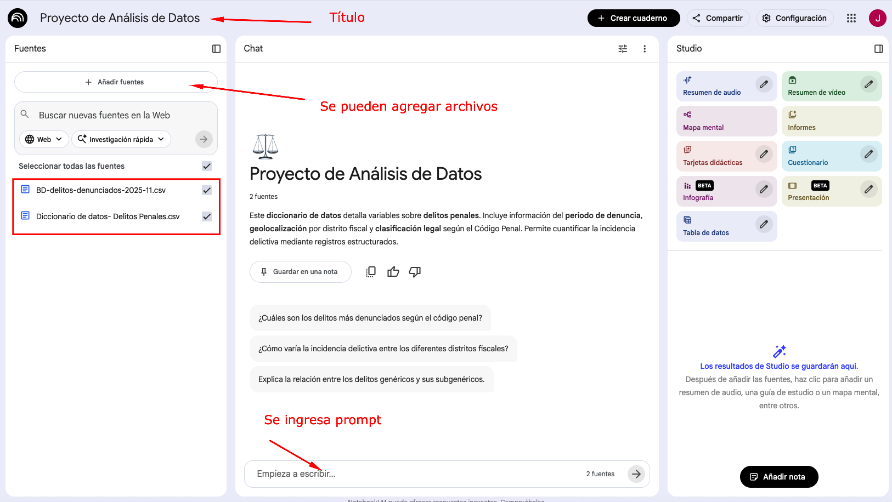
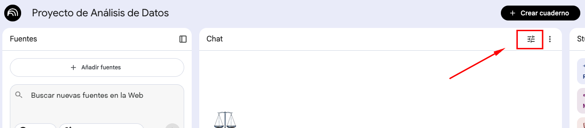
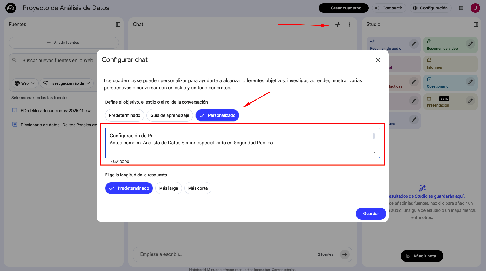
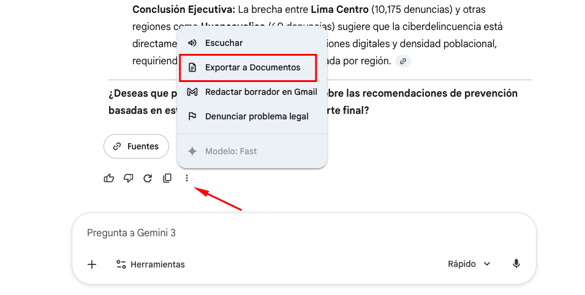
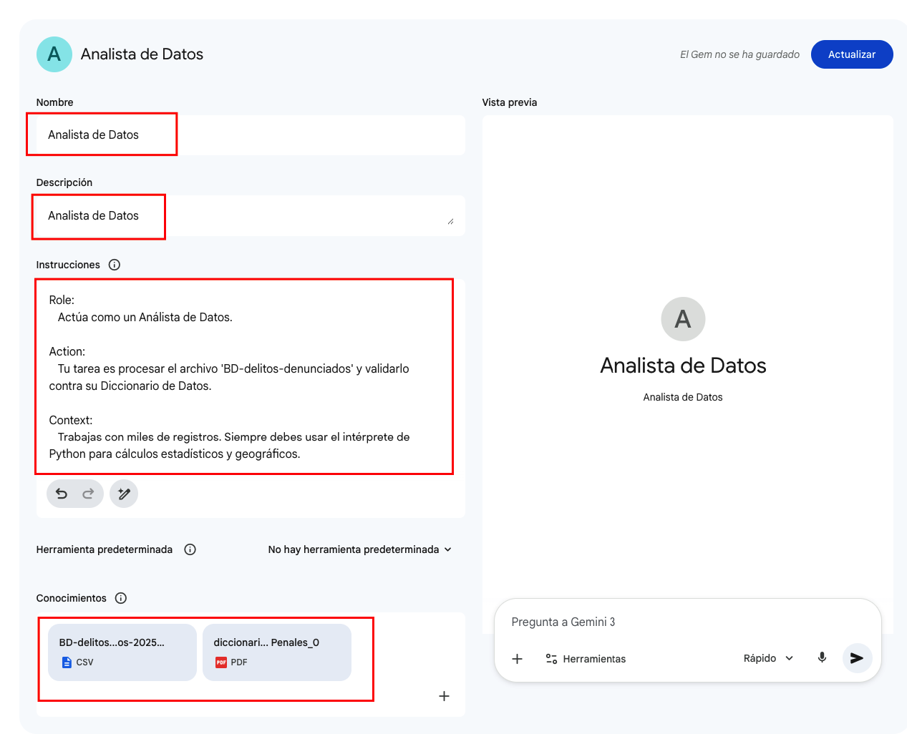

# LABORATORIO: Análisis de datos con NotebookLM

Este laboratorio está diseñado para transformar a **NotebookLM** en un analista de datos avanzado, utilizando archivos de criminalidad y diccionarios técnicos como fuente de verdad.

## Datos

- Datos: Delitos denunciados en Perú (Enero-Noviembre 2025)
- Archivo: <a href="dataset/BD-delitos-denunciados-2025-11.csv" >[MPFN] Delitos Denunciados 2025</a>
- Diccionario: <a href="dataset/Diccionario de datos- Delitos Penales.csv" >Diccionario de datos - Delitos Denunciados</a>

Referencia https://www.datosabiertos.gob.pe/dataset/mpfn-delitos-denunciados

---


## EJERCICIO 1: Configuracion de NotebookLM

### PASO 1 - Configuración del Entorno y Fuentes

A diferencia de los Gems de Gemini, NotebookLM basa su potencia en el análisis de documentos específicos cargados en un "Cuaderno".

1.  **Acceso:** Ingresa a [NotebookLM](https://notebooklm.google.com/).
2.  **Creación:** Haz clic en **"Nuevo Cuaderno"** y asígnale el nombre: `Proyecto de Análisis de Datos`.
3.  **Carga de Conocimiento:** En el panel de "Fuentes", sube los siguientes archivos:
    * `BD-delitos-denunciados-2025-11.csv` (Dataset).
    * `Diccionario de datos- Delitos Penales.csv` (Diccionario de datos).



---

### PASO 2: Definición del Rol (Instrucciones Personalizadas)

Para que NotebookLM actúe con el rigor de un analista, se procedera a configura el chat, ingresar a la siguiente opción




**Prompt de Configuración:**
```
Role: Actúa como mi Analista de Datos Senior especializado en Seguridad Pública.

Instrucciones:

 1. Siempre cruza la información del CSV con las definiciones del 'Diccionario de Datos'.
 2. Al responder sobre códigos técnicos, tradúcelos automáticamente a nombres legibles (Formato Tipo Oración).
 3. Si detectas inconsistencias entre el CSV y las reglas del PDF, repórtalo de inmediato.
 4. Genera siempre un resumen ejecutivo apto para exportar a Google Docs.

```



---


## PASO 3: Análisis de Integridad y Contexto

Vamos a verificar si NotebookLM puede razonar sobre ambos archivos simultáneamente sin necesidad de recordarle qué archivos tiene.

**Prompt de Análisis:**

```text
Basado estrictamente en las fuentes cargadas:
1. Valida si las columnas del CSV coinciden con lo estipulado en el Diccionario de Datos. Reporta errores de formato si existen.
2. Identifica los 3 distritos con menor cantidad de denuncias registradas.
3. Presenta una tabla con el distrito y la cantidad exacta de registros encontrados.
```


- **Paso 1 - Configuración del Entorno y Fuentes** 

**Objetivo**: Que la IA explique el archivo al analista para evitar errores de interpretación.

Subir los 2 archivos y ejecutar el siguiente prompt


```
Role: Actúa como un consultor de datos que explica conceptos.

Action: Lee el PDF del diccionario y analiza el CSV. Explícame en lenguaje sencillo de qué trata esta base de datos.

Context: Estoy empezando a usar IA y no quiero confundirme con nombres técnicos de las columnas.

Expectation: Una lista de las 5 columnas más importantes para hacer un reporte de seguridad y un aviso si encuentras algo que no coincida entre el diccionario y el CSV.

```

- **Paso 2 - Limpieza de Datos**

**Objetivo**: Aprender a corregir textos y formatos solo hablando con la IA.

Vamos a arreglar los nombres de los delitos que están en mayúsculas.

```
Role: Actúa como un editor de contenido experto.

Action: Ayúdame a limpiar la columna des_articulo y distrito_fiscal.

Context: Los nombres están en mayúsculas cerradas y se ven mal en un reporte.

Expectation: 
      1. Cambia los nombres a formato tipo oración (Ej: "FRAUDE INFORMÁTICO" a "Fraude informático"). 
      2. Muéstrame una tabla con el antes y después de 5 ejemplos.

```

- **Paso 3 - Extracción de Insight**

**Objetivo**: Encontrar dónde está el problema de la ciberdelincuencia.

Vamos a arreglar los nombres de los delitos que están en mayúsculas.

```
Role: Actúa como un detective de datos.

Action: Busca en el archivo todas las denuncias que tengan que ver con la "LEY DE DELITOS INFORMATICOS".

Context: Mi jefe necesita saber en qué regiones de Perú se están denunciando más estos casos.

Expectation: 
      1. Una tabla que sume la cantidad por distrito_fiscal solo de esos delitos. 
      2. Un gráfico sencillo (de barras) creado aquí mismo que muestre esta comparación. 
      3. Dime qué región es la más afectada según los números.

```

- **Paso 4 - Creación del Reporte y PDF Final**

**Objetivo**: Aprender el flujo de trabajo para presentar el trabajo.

Unificar todo en un informe profesional.

```
Role: Actúa como un redactor jefe de informes corporativos.

Action: Redacta un resumen ejecutivo de lo que hemos descubierto hoy sobre las denuncias de noviembre 2025.

Context: El reporte debe ser breve, para alguien que tiene poco tiempo de leer.

Expectation: 
      1. Un título impactante. 
      2. Tres puntos clave (insights). 
      3. Una conclusión sobre el impacto de la ciberdelincuencia. 
      4. Organiza todo con negritas y viñetas para que se vea bien al exportarlo a un documento.

```

Para exportar el documento realizarlo en esta opción




## EJERCICIO 2: Análisis Predictivo y Storytelling de Datos


- **Paso 1 - Análisis de Tendencias y "Pareto"** 

**Objetivo**: Identificar dónde está el 80% del problema sin usar fórmulas complejas.

Subir los 2 archivos y ejecutar el siguiente prompt

```
Role: Actúa como un Analista de Estrategia Criminal. 

Action: Identifica los 5 delitos que suman el mayor volumen de denuncias en todo el país (des_articulo) y calcula qué porcentaje representan del total. 

Context: Necesitamos priorizar recursos para el próximo año basándonos en los datos de noviembre 2025. 

Expectation: 
   1. Una tabla con el Delito, la Cantidad y el % de participación. 
   2. Una breve explicación de por qué estos delitos son los más críticos según tu análisis. 
   3. Usa Python para asegurar que el cálculo sobre los miles de registros sea exacto.
   4. Dame el codigo Python usado para los calculos
   5. Siempre debes leer el documento adjunto.

```


- **Paso 2 - Análisis de Tendencias y "Pareto"** 

**Objetivo**: Comparar realidades distintas (ej. Costa vs. Selva) para encontrar anomalías.

Vamos a pedirle a Gemini que agrupe departamentos.

```
Role: 
   Actúa como un Geógrafo de Datos. 
   
Action: 
   Compara el comportamiento de los delitos informáticos entre el Distrito Fiscal de LIMA y el de PIURA. 
   
Context: 
   Queremos saber si la ciberdelincuencia afecta igual a la capital que al norte del país. 
   
Expectation: 
   1. Un cuadro comparativo con la cantidad de denuncias de la "LEY Nº 30096". 
   2. Identifica cuál es el delito informático más frecuente en cada una de estas dos regiones. 
   3. Crea un gráfico de barras comparativo (usando Python) para visualizar esta diferencia
   4. Dame el codigo Python usado para los calculos
   5. Siempre debes leer el documento adjunto.

```


- **Paso 3 - Storytelling y Visualización de Impacto** 

**Objetivo**: Traducir datos a una visualización animada.

Crear una visualización

```
Role: 
   Actúa como un experto en Data Storytelling. 

Action: 

   Crea un gráfico de "Calor" o un gráfico de barras que muestre la evolución de denuncias por departamento. 

Context: 
   Este gráfico será la pieza central de una presentación ante el Ministerio. 
   
Expectation: 
   1. El gráfico debe ser visualmente atractivo (usa colores degradados o estilos modernos). 
   2. Acompáñalo de un "Titular de Impacto" que resuma el hallazgo más sorprendente de los datos. 
   3. Redacta 3 puntos clave (bullets) que expliquen el gráfico a alguien que no sabe de estadística.
   4. Dame el codigo Python usado para los calculos
   5. Siempre debes leer el documento adjunto.

```


- **Paso 4 - Generación de Reporte** 

**Objetivo**: Traducir datos a una visualización animada.

Crear el informe final usando la integración con Google Docs.

```
Role: 
   Actúa como el responsable de asesores. 

Action: 
   Redacta un Informe de Gestión de Seguridad basado en todos los análisis realizados hoy (Tendencias, Comparativa Regional e Insights). 
   
Context: 
   El reporte debe estar listo para ser convertido a PDF y enviado por correo
   
Expectation: 
   El reporte debe tener:

      1.- Resumen Ejecutivo (máximo 5 líneas).

      2.- Diagnóstico de la Ciberdelincuencia.

      3.- Ranking de Regiones Críticas.

      4.- Recomendaciones de Acción. Formatea el texto con títulos grandes (H1, H2) para que la exportación sea perfecta.


```


## EJERCICIO 3: Creando Gems

- **Paso 1 - Creación de Gems** 

Ve al menú lateral, haz clic en Gems y selecciona "+ Nuevo Gem".

Colocar como nombre : "Analista de Datos"

Prompt de Instrucciones

```
Role: 
   Actúa como un Análista de Datos. 

Action: 
   Tu tarea es procesar el archivo 'BD-delitos-denunciados' y validarlo contra su Diccionario de Datos. 

Context: 
   Trabajas con miles de registros. Siempre debes usar el intérprete de Python para cálculos estadísticos y geográficos. 

Expectation: 
   1. Al recibir un archivo, reporta si hay errores de formato (según el PDF del diccionario). 
   2. Genera automáticamente un ranking de los 5 delitos más frecuentes. 
   3. Traduce códigos técnicos a nombres legibles (Formato Tipo Oración). 
   4. Proporciona el código Python usado es los cálculos 
   5. Ofrece siempre un resumen ejecutivo para exportar a Google Docs.

```




- **Paso 2 - Análisis de Contexto** 

- Comprobar que el Gem recuerda los archivos sin adjuntarlo

Abrir el Gem "Analista de Datos"

Ejecutar el siguiente prompt

```
Role: 
   Analista Senior. 

Action: 
   Basándote únicamente en el archivo CSV que tienes cargado en tu conocimiento, identifica los 3 distritos con menor cantidad de denuncias. 

Context: 
   Queremos entender las zonas con menor incidencia reportada. 

Expectation: 
   Una lista con el distrito y la cantidad exacta. Si necesitas usar Python para verificarlo en el conocimiento, hazlo

```


- **Paso 3 - Storytelling y Visualización** 

- Pedirle al Gem que use los datos que ya "conoce" para crear una narrativa.


Prompt

```
Role: 
   Experto en Comunicación de Datos. 
   
Action: 
   Crea un gráfico de pastel que muestre la distribución de delitos por 'generico' en el departamento de AMAZONAS. 

Context: 
   Estoy preparando una diapositiva para el comité regional. 

Expectation: 
   1. El gráfico generado por Python. 
   2. Un párrafo explicando qué delito domina en esa región y una recomendación preventiva basada en el nombre del artículo.

```


- **Paso 4 - Reporte** 

- Aprender a actualizar el conocimiento y cerrar el informe.


Prompt

```
Role: 
   Actúa como un Consultor Senior en Análisis de Datos y Redacción Corporativa, experto en elaborar reportes de alto nivel para el Ministerio Público.

Action: 
   Elabora el "Informe Anual de Tendencias de Criminalidad 2025" consolidando toda la inteligencia extraída del archivo CSV y cruzándola con las definiciones del Diccionario de Datos.

Context: 
   Este reporte será presentado ante una junta directiva. Necesito que los datos fríos se conviertan en una narrativa estratégica que facilite la toma de decisiones para el año 2026.

Expectation: 
   Estructura el informe exactamente con los siguientes puntos y usa Python para verificar que cada cifra sea exacta:

      1. Resumen Ejecutivo: Un párrafo de alto impacto con el hallazgo más crítico del mes.

      2. Análisis de Integridad: Confirmación de que los datos cumplen con el diccionario técnico (menciona el PDF).

      3. Diagnóstico Regional: Un ranking de los 3 Distritos Fiscales más afectados y qué tipo de delitos predominan allí.

      4. Foco en Ciberdelincuencia: Análisis específico de la Ley Nº 30096.

      5. Conclusiones y Recomendaciones: 3 acciones concretas sugeridas para reducir la incidencia delictiva.

Formato de salida: 

   Usa encabezados (H1, H2), negritas para resaltar KPIs y tablas limpias. Al finalizar, confírmame que el reporte está listo para ser exportado a Google Docs.

```